<h1 align="center">Hi, I'm Philipp</h1>

###

  

###

<h2 align="center">📌 Profile Overview</h2>

  

    📖 Computer Science Student @ <a href="https://www.fhv.at/">FH Vorarlberg</a> 
    💼 Software Quality Assurance 
    🖥️ Homelab owner 
    💡 <a href="https://www.home-assistant.io/">Home Automation</a> tinkerer
  

###

<h2 align="center">🛠️ Toolkit</h2>

<h3 align="center">Languages & Frameworks</h3>

  
   
  

<h3 align="center">GitHub Stats</h3>

  
  

###

<h2 align="center">📫 Contact me</h2>

  

